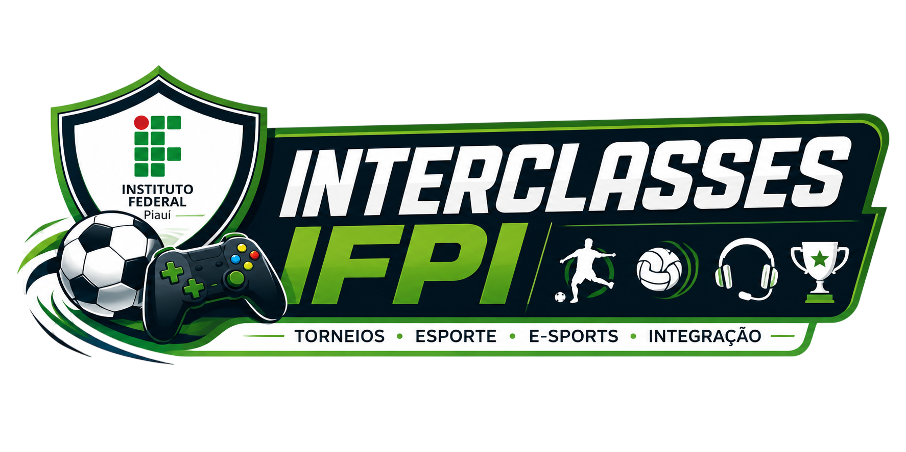

# 🏆 Interclasses IFPI 2026

<p align="center">
  
</p>

<p align="center">
  <strong>Plataforma web para gerenciamento e acompanhamento do campeonato interclasse do Instituto Federal do Piauí (IFPI)</strong>
</p>

<p align="center">
  
  
  
  
</p>

---

## 📋 Sumário

- [Sobre o Projeto](#-sobre-o-projeto)
- [Funcionalidades](#-funcionalidades)
- [Estrutura do Projeto](#-estrutura-do-projeto)
- [Páginas](#-páginas)
- [Times Participantes](#-times-participantes)
- [Esportes](#-esportes)
- [Tecnologias Utilizadas](#-tecnologias-utilizadas)
- [Como Executar](#-como-executar)
- [Contribuição](#-contribuição)
- [Licença](#-licença)
- [Autor](#-autor)

---

## 📖 Sobre o Projeto

O **Interclasses IFPI 2026** é uma plataforma web desenvolvida para centralizar e facilitar o acompanhamento do campeonato interclasse do Instituto Federal do Piauí. O sistema permite que alunos, professores e a comunidade escolar visualizem resultados, classificações, perfis de times e realizem inscrições de equipes de forma simples e organizada.

O projeto foi criado como uma iniciativa para digitalizar e modernizar a gestão do tradicional evento esportivo do IFPI, promovendo a integração entre os alunos dos diferentes cursos da instituição.

---

## ✨ Funcionalidades

- 🏠 **Página inicial** com destaques do campeonato e resultados recentes
- 📊 **Tabela de classificação** com filtros por esporte e gênero
- 🗃️ **Mural de informações** com regulamento, horários, artilheiros e galeria de fotos
- 👕 **Perfil de times** com estatísticas individuais de cada equipe
- 📝 **Formulário de inscrição** para cadastro de novas equipes
- 📰 **Últimas notícias** do campeonato no rodapé de todas as páginas

---

## 📁 Estrutura do Projeto

```
interclasse_ifpi/
│
├── assets/
│   ├── logo.png              # Logo oficial do campeonato
│   ├── logo_psg.png          # Logo dos times (placeholder)
│   └── fundo.jpg             # Imagem de fundo da hero section
│
├── index.html                # Página inicial (Home)
├── classificacao.html        # Tabela de classificação
├── mural.html                # Mural de informações
├── formulario.html           # Formulário de inscrição de equipe
│
├── perfiltsi_1.html          # Perfil: TSI 1º Módulo
├── perfiltsi_3.html          # Perfil: TSI 3º Módulo
├── perfiladm_2.html          # Perfil: ADM Manhã 2º Ano
├── perfiladm_3.html          # Perfil: ADM Manhã 3º Ano
├── perfilinfo_4.html         # Perfil: INFO Manhã 3º Ano
│
├── style_home.css            # Estilos da página inicial
├── style_classificacao.css   # Estilos da página de classificação
├── formulario.css            # Estilos do formulário de inscrição
├── mural.css                 # Estilos do mural
├── perfiltimes.css           # Estilos compartilhados dos perfis de times
│
└── LICENSE                   # Licença MIT
```

---

## 📄 Páginas

### 🏠 Home (`index.html`)
Página principal do site. Exibe o banner do campeonato **Interclasses IFPI 2026** com acesso rápido à tabela de classificação e ao formulário de inscrição. Também apresenta a seção de **Resultados Recentes** com os confrontos mais recentes entre as equipes.

### 📊 Classificação (`classificacao.html`)
Exibe a tabela de classificação geral do campeonato. Possui filtros dinâmicos por **esporte** (Futsal, Vôlei, Handebol) e **gênero** (Masculino, Feminino). Cada colocado na tabela possui um link direto para o perfil do respectivo time.

### 🗃️ Mural (`mural.html`)
Área central de informações do campeonato, contendo:
- Link para o **regulamento** oficial em PDF
- **Horários e jogos** do dia com os confrontos programados
- **Mini tabela** de classificação com pontuação
- **Ranking de artilheiros**
- **Destaques da rodada** (MVP, melhor defesa, jogo mais disputado)
- **Galeria de fotos** do campeonato

### 📝 Formulário de Inscrição (`formulario.html`)
Formulário completo para inscrição de equipes, coletando:
- Nome da equipe
- Curso (ADSI, Informática, Redes) e Turma (1º, 2º ou 3º Ano)
- Nome do capitão
- E-mail de contato
- WhatsApp do capitão
- Lista de jogadores (nome completo e matrícula) — mínimo 5, máximo 7 jogadores
- Aceite do regulamento do campeonato

### 👕 Perfis de Times
Cada equipe participante possui uma página de perfil individual com:
- Nome e cor principal do time
- Nome do capitão
- Escudo/emblema do time
- Estatísticas: **Vitórias**, **Empates** e **Derrotas**

---

## 👥 Times Participantes

| Colocação | Time | Curso | Vitórias | Empates | Derrotas |
|:---------:|------|-------|:--------:|:-------:|:--------:|
| 🥇 1º | TSI 1º Módulo | Tecnologia em Sistemas para Internet | 4 | 2 | 1 |
| 🥈 2º | ADM Manhã 2º Ano | Administração | 3 | 3 | 1 |
| 🥉 3º | TSI 3º Módulo | Tecnologia em Sistemas para Internet | — | — | — |
| 4º | INFO Manhã 3º Ano | Informática | — | — | — |
| 5º | ADM Manhã 3º Ano | Administração | — | — | — |

---

## ⚽ Esportes

O campeonato contempla as seguintes modalidades esportivas:

- ⚽ **Futsal** (Masculino e Feminino)
- 🏐 **Vôlei** (Masculino e Feminino)
- 🤾 **Handebol** (Masculino e Feminino)

---

## 🛠️ Tecnologias Utilizadas

| Tecnologia | Uso |
|------------|-----|
| **HTML5** | Estrutura de todas as páginas |
| **CSS3** | Estilização e layout responsivo |
| **CSS Custom Properties** | Paleta de cores e temas consistentes |
| **CSS Grid** | Layout da navegação |
| **CSS Flexbox** | Alinhamento e distribuição dos componentes |

> O projeto é desenvolvido em **HTML e CSS puros**, sem dependência de frameworks ou bibliotecas externas.

### 🎨 Paleta de Cores

| Variável | Cor | Uso |
|----------|-----|-----|
| `--cor01` | `#006B3F` | Verde escuro — cor primária |
| `--cor02` | `#00C853` | Verde vibrante — destaques |
| `--cor03` | `#121212` | Preto suave — header e footer |
| `--cor04` | `#1E1E1E` | Cinza escuro — fundo do corpo |
| `--cor05` | `#FFFFFF` | Branco — textos |
| `--cor06` | `#2563EB` | Azul — elementos de destaque |
| `--cor07` | `#1E3A5F` | Azul escuro — uso complementar |

---

## 🚀 Como Executar

Por ser um projeto estático em HTML e CSS, não requer nenhuma instalação de dependências ou servidor back-end.

### Pré-requisitos

- Um navegador web moderno (Google Chrome, Firefox, Edge, Safari etc.)

### Passos

1. **Clone o repositório:**
   ```bash
   git clone https://github.com/lucaslandimdev/interclasse_ifpi.git
   ```

2. **Acesse a pasta do projeto:**
   ```bash
   cd interclasse_ifpi
   ```

3. **Abra a página inicial no navegador:**
   - Abra o arquivo `index.html` diretamente no navegador, ou
   - Use uma extensão como o **Live Server** (VS Code) para melhor experiência de desenvolvimento.

### Com VS Code + Live Server

```bash
# Instale a extensão Live Server no VS Code
# Clique com o botão direito em index.html
# Selecione "Open with Live Server"
```

---

## 🤝 Contribuição

Contribuições são bem-vindas! Siga os passos abaixo:

1. Faça um **fork** do repositório
2. Crie uma branch para sua feature:
   ```bash
   git checkout -b feature/minha-feature
   ```
3. Faça as alterações e commit:
   ```bash
   git commit -m "feat: adiciona minha nova feature"
   ```
4. Envie para o repositório remoto:
   ```bash
   git push origin feature/minha-feature
   ```
5. Abra um **Pull Request**

### Sugestões de Melhorias

- [ ] Adicionar back-end para persistência de dados (inscrições, placar, classificação)
- [ ] Implementar responsividade completa para dispositivos móveis
- [ ] Adicionar autenticação para área administrativa
- [ ] Integrar galeria de fotos com imagens reais do campeonato
- [ ] Implementar funcionalidade de busca de jogadores/times
- [ ] Criar página de calendário completo de jogos

---

## 📄 Licença

Este projeto está licenciado sob a **Licença MIT**. Veja o arquivo [LICENSE](LICENSE) para mais detalhes.

```
MIT License — Copyright (c) 2026 lucaslandimdev
```

---

## 👤 Autor

Desenvolvido por **Lucas Landim** como projeto para o **Instituto Federal do Piauí (IFPI)**.

<p align="center">
  <a href="https://github.com/lucaslandimdev">
    
  </a>
</p>

---

<p align="center">
  <strong>Instituto Federal do Piauí • Interclasses 2026</strong><br/>
  <em>Esporte • Integração • Respeito</em>
</p>
